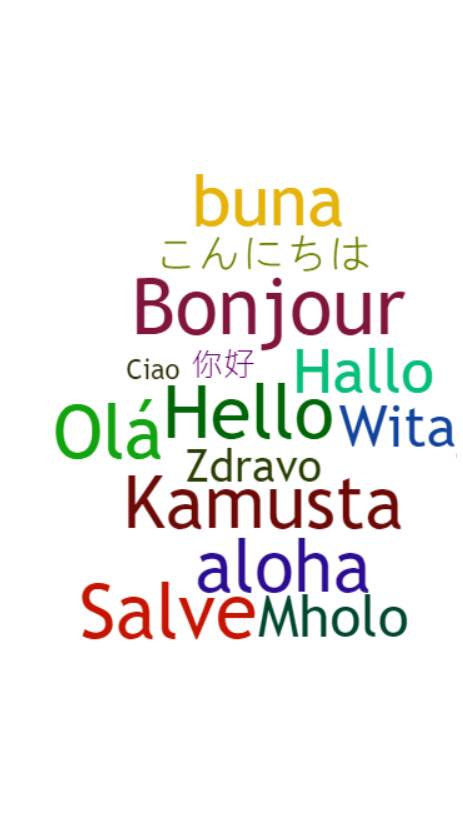
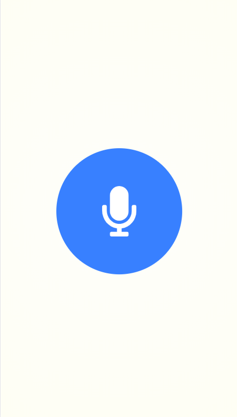

# language-detection
Ionic ios app that uses Google Speech to detect languages

<table>
<thead></thead>
<tbody>
<tr align="center">
<td>Welcome Animation</td><td> Detect Button </td>
</tr>
<tr>
<td></td><td></td>
</tr>

</tbody>
</table>

## Getting Started
Clone or download the project to your system

### Prerequisites
Python, Ionic, Node.js, Angular

### Running

Start Flask server

<pre>python detect.py</pre>

Install the app on ios device

<pre>ionic cordova run ios --device</pre>
